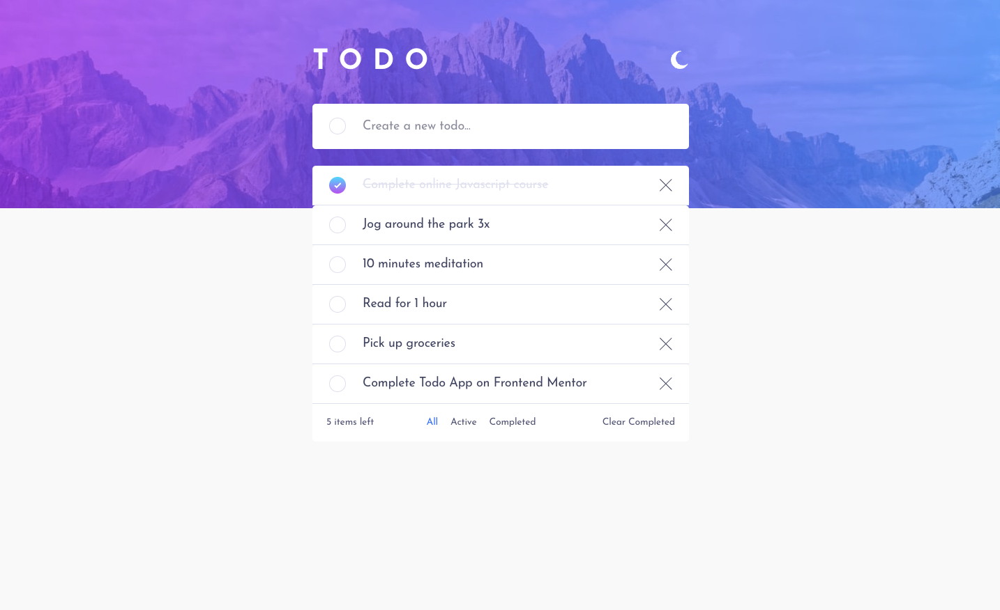
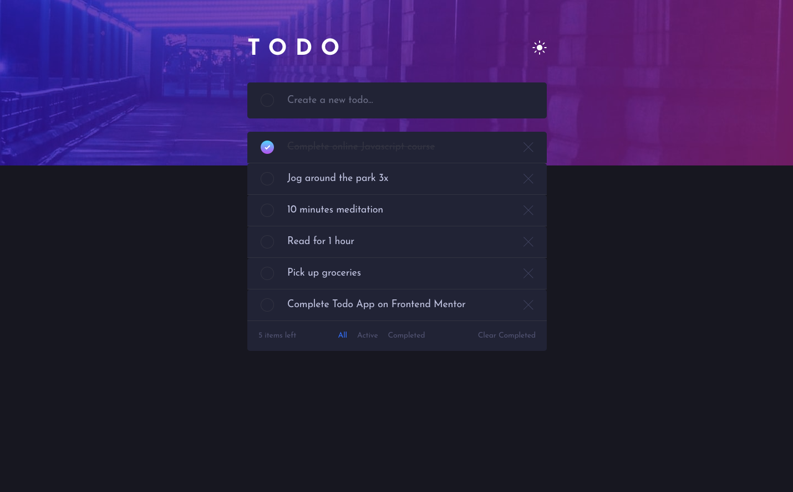

# Frontend Mentor - Todo app solution

This is a solution to
the [Todo app challenge on Frontend Mentor](https://www.frontendmentor.io/challenges/todo-app-Su1_KokOW). Frontend
Mentor challenges help you improve your coding skills by building realistic projects.

## Table of contents

- [Overview](#overview)
    - [The challenge](#the-challenge)
    - [Screenshot](#screenshot)
    - [Links](#links)
- [My process](#my-process)
    - [Built with](#built-with)
    - [What I learned](#what-i-learned)
    - [Continued development](#continued-development)
    - [Useful resources](#useful-resources)
- [Author](#author)

## Overview

### The challenge

Users should be able to:

- View the optimal layout for the app depending on their device's screen size
- See hover states for all interactive elements on the page
- Add new todos to the list
- Mark todos as complete
- Delete todos from the list
- Filter by all/active/complete todos
- Clear all completed todos
- Toggle light and dark mode
- **Bonus**: Drag and drop to reorder items on the list

### Screenshot

### Links

- Solution URL: [Add solution URL here](https://your-solution-url.com)
- Live Site URL: [Add live site URL here](https://your-live-site-url.com)

## My process

### Built with

- SvelteKit
- Svelte DND Action (https://github.com/isaacHagoel/svelte-dnd-action)

### What I learned

Wanted to learn about Svelte Stores, how to do light and dark modes, and drag'n'drop.

The original store creation was fine, but quickly realised that mutating the store in a number of files was likely to
lead to confusion, complication and potentially abuse if the application was being worked on by multiple developers.
LiHau does a very good Svelte stores overview on YouTube, which also mentions keeping actions with the store. If you are
interested in Svelte, checkout Lihau.  (https://youtu.be/qtxG-aoXXCM)

Light and Dark mode was fine, although there are numerous ways to achieve this. I would probably look at a different way
to do this next time around such as simply adding a class to the body directly rather than via a variable or store.

Drag'nDrop, I could have written this from scratch but opted to use a plugin so I could work on implementing and
understanding how to adapt others code.

### Continued development

This app was mostly created to learn a number of area's. The code could be refactored, and there are certainly better or
more efficient ways to do certain elements of it. Such as light/dark mode, and the way I have used css variables could
be improved and better named etc.

The drag and drop defaults to light mode for the dragged item.

### Useful resources

- [Svelte Drag and Drop](https://github.com/isaacHagoel/svelte-dnd-action) - Drag and Drop plugin for Svelte.
- [Watch the excellent Lihau](https://www.youtube.com/c/lihautan) - Lihau YouTube channel

**Note: Delete this note and replace the list above with resources that helped you during the challenge. These could
come in handy for anyone viewing your solution or for yourself when you look back on this project in the future.**

## Author

- Website - [Darren Potter](https://www.darpots.dev)
- Frontend Mentor - [@darpots](https://www.frontendmentor.io/profile/darpots)
- Twitter - [@darpots](https://www.twitter.com/darpots)
